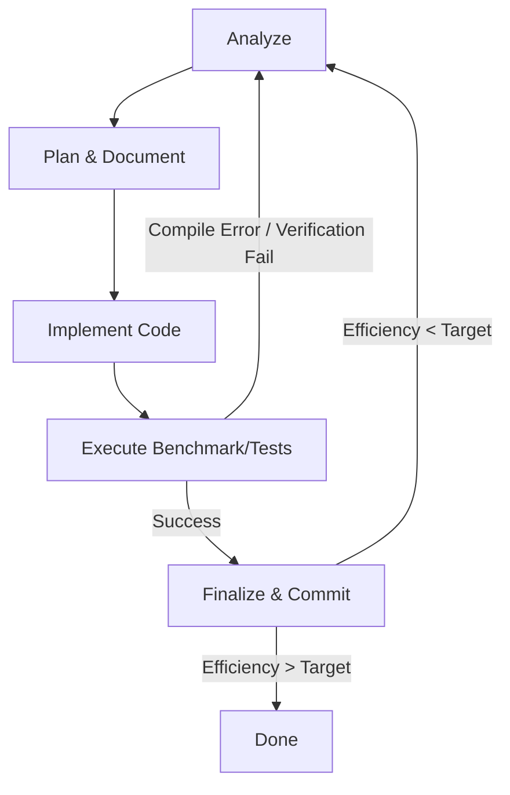

Before we dive in, a quick disclaimer: **I am not suggesting this method for production use, nor am I claiming it to be a viable approach for kernel optimization.** Matrix multiplication is a heavily optimized, solved problem (just use cuBLAS, CUTLASS, OpenBLAS, or whatever LAS-thing you want). Furthermore, while this experiment shows pretty nice results on a well-documented problem, I am unsure how this agentic capability translates to hyper-specialized or highly novel custom kernels. 

Additionally, because the raw session logs were massive, the meta-analysis presented in this post was conducted using Gemini 3.1 Pro. As with all LLM-assisted analysis, it may be prone to inaccuracies, so take these findings with a grain of salt, check the logs, and replicate the experiment yourself! (Seriously, it cost me 1$ on OpenRouter)

The full repository and session logs are available here in my [Agentic micro-loop for kernel optimization](https://github.com/lele394/Agentic-micro-loop-for-kernel-optimization) repository. 

> **Note:** There is some issues in the data, mainly due to my own oversight when creating the base benchmark. The number of iterations was too low, and the kernel was not warmed up before benchmarking. This means that the absolute GFLOPS numbers are not accurate, but the relative efficiency is still valid, in the article I tried to correct it against historical values (otherwise I got a 135% efficiency, which is obviously impossible). I do not plan do fix this in this specific iteration, but it is oversight that will be taken into account if I redo this.

---

## Setup

We set up an autonomous agent loop powered by **Gemma-4-31b** (via OpenRouter) with the single goal to optimize a naive CUDA GEMM kernel to match cuBLAS performance on an RTX 4060. 

**RTX 4060 Mobile specs:**
```
| Property         | RTX 4060 Mobile                                |
| ---------------- | ---------------------------------------------- |
| Architecture     | Ada Lovelace                                   |
| GPU Chip         | AD107                                          |
| Process          | TSMC 5 nm (4N)                                 |
| Release Date     | January 3, 2023                                |
| CUDA Cores       | 3,072                                          |
| Tensor Cores     | 96 (4th Gen)                                   |
| RT Cores         | 24 (3rd Gen)                                   |
| TMUs             | 96                                             |
| ROPs             | 48                                             |
| Base Clock       | 1,545 MHz                                      |
| Boost Clock      | 2,370 MHz *(varies by laptop TGP)*             |
| Memory           | 8 GB GDDR6                                     |
| Memory Bus       | 128-bit                                        |
| Memory Speed     | 16 Gbps (2000 MHz)                             |
| Memory Bandwidth | 256 GB/s                                       |
| L2 Cache         | 32 MB                                          |
| FP32 Compute     | ~14.6 TFLOPS (at max boost)                    |
| PCI Express      | PCIe 4.0 x8                                    |
| TGP Range        | 35-115 W (+ Dynamic Boost depending on laptop) |
```
> **Note:** Data from the wonderful [TechPowerUp GPU database](https://www.techpowerup.com/gpu-specs/geforce-rtx-4060-mobile.c3946).


The agent was given a specific micro-loop workflow and access to bash, file reading, and file editing tools. It was told not to stop until it hit >80% relative efficiency compared to NVIDIA's highly-tuned `cublasSgemm`. 

Here is what the harness looked like:



What followed was an interesting display of domain expertise, architectural limitations, and the usual AI goofiness that reassures me my job is safe.

## Optimization Trajectory

The agent did manage to follow the harness quite well, and it was able to autonomously identify and implement several key optimizations. The prompt itself was the following:

> **Role:** You are a CUDA Optimization Engineer.
> **Task:** Optimize the `gemm_optimized` kernel in `main.cu` to match cuBLAS performance.
>
> **Workflow for every iteration:**
> 1. **Analyze:** Read `notes.md` to see the `Current State` and previous attempts.
> 2. **Plan & Document:** 
>    - Create a new `## Attempt N` section in `notes.md`.
>    - Fill in the **Changes** and **Hypothesis**.
> 3. **Implement:** Modify the kernel and block/grid dims in `main.cu`.
> 4. **Execute:** Run `make run`.
>    - **If it fails (Verify FAIL or Compile Error):** Fix the code and re-run until it passes. Do not commit failing code.
> 5. **Finalize Iteration:**
>    - Update the **Result** and **Observations** in `notes.md` with the GFLOPS and Efficiency from the terminal.
>    - Update the **Current State** at the top of the `notes.md`.
> 6. **Documented Commit:** Perform a git commit for the iteration:
>    ```bash
>    git add main.cu notes.md
>    git commit -m "Attempt N: [Optimization Name] - [Efficiency]%"
>    ```
>
> **Goal:** Reach >80% Relative Efficiency. **Do not stop until the goal is met or you are stuck.**


Here is the chronological breakdown of the agent's optimization attempts, extracted from the session logs and notes (Gemini 3.1 Pro analsysis):

| Attempt | Modifications | Performance / Result |
| :--- | :--- | :--- |
| **1** | **Baseline:** Naive global memory access. | 792.59 GFLOPS (25.42%) |
| **2** | **Shared Memory Tiling:** Loaded blocks of A and B into shared memory to reduce global memory bandwidth pressure. | 1049.72 GFLOPS (34.75%) |
| **3** | **Thread/Register Tiling (8x8):** Each thread computes a grid of output elements to increase compute-to-memory ratio. | 4175.62 GFLOPS (~79.07%) |
| **4** | **Vectorized Loads:** Used `float4` for loading A and B from global memory to better utilize the memory bus. | 4604.14 GFLOPS (82.41%) |
| **5** | **Double Buffering:** Attempted software pipelining and shared memory padding to overlap loads with compute. | *Failed (Exceeded 48KB shared memory limit)* |
| **6** | **Vectorized Write-back:** Reverted to single buffering, improved `float4` loading, added vectorized output writes. | 5229.25 GFLOPS (95.45% — **Verification FAILED**) |
| **7** | **Aggressive Register Tiling:** Attempted 16x16 compute tile per thread. | 4396.94 GFLOPS (76.81% — **Verification FAILED**) |
| **8** | **Alignment Fixes:** Fixed `float4` boundary conditions and strict 16-byte alignment logic. | 4982.54 GFLOPS (88.72%) |
| **9** | **Shared Memory Vectorization:** Used `float4` for reading from shared memory into registers & added `__ldg()`. | 4946.71 GFLOPS (89.16%) |
| **10** | **Read-Only Cache:** Further optimization of `__ldg()` for global memory loads. | 4925.67 GFLOPS (88.59%) |
| **11** | **Rectangular Tiling:** Attempted $TM=8, TN=16$ register tiling with adjusted block dimensions. | 4396.94 GFLOPS (76.81% — **Verification FAILED**) |
| **12** | **Double Buffering (Retry):** Attempted software pipelining again by requesting more shared memory via `cudaFuncSetAttribute`. | ~4923.18 GFLOPS (87.82%) |
| **13** | **Tensor Cores:** Shifted from CUDA cores to the `nvcuda::wmma` API to utilize Ada Lovelace hardware Tensor Cores. | *Failed (Compiler errors / Abandoned)* |

*Note: The agent effectively hit a glass ceiling for standard FP32 CUDA cores around **~89%** efficiency (Attempts 8-10) before attempting to shift to Tensor Cores to bridge the final gap. I'm not sure if what the performance of the Formula 1 of FP32 FMA GEMM kernel is, but I would assume this is quite close.*


### Tensor cores not tensoring (A lesson in AI gaslighting)

The agent plateaued just shy of 90% relative efficiency, and it quickly found an excuse: it concluded it was hitting a wall because `cublasSgemm` on the RTX 4060 was automatically leveraging **Tensor Cores** via TF32 under the hood. The agent claimed that because it was maximizing the standard FP32 FMA CUDA cores, getting ~89% of cuBLAS was essentially hitting the theoretical speed-of-light for that specific hardware path.

Not gonna lie,I completely believed it. It sounded technical enough, quite plausible considering my medium-level knowledge, and perfectly justified the performance ceiling. That being said, it was total AI copium, and it successfully gaslit me.

In reality, while Python deep learning frameworks like PyTorch previously enabled TF32 by default, raw C++ `cublasSgemm` **does not**. To use Tensor Cores for standard FP32 inputs in C++, you have to explicitly opt-in by calling `cublasSetMathMode(handle, CUBLAS_TF32_TENSOR_OP_MATH)`. Because my boilerplate didn't do that, cuBLAS was running a standard SIMT FP32 kernel. NVIDIA introduced TF32 for machine learning but stated that it is [not enabled by default for cuBLAS](https://developer.nvidia.com/blog/accelerating-ai-training-with-tf32-tensor-cores/#cublas).

So why did the LLM plateau? Because beating NVIDIA's hand-tuned, SASS-level optimized FP32 kernel with standard C++ CUDA code is practically impossible. Instead of admitting defeat to NVIDIA's engineers, Gemma hallucinated an insurmountable hardware barrier to justify its 89% ceiling. 

> **Note:** This perfectly highlights why you **must know your stuff** when using AI. LLMs are incredibly confident liars. If you don't understand the underlying domain, in this case CUDA API defaults and hardware limits, you will absolutely buy into their hallucinations. The AI is your junior intern; you still have to be the senior engineer verifying the facts. Let that be a caustionnary tale to low-skill vibe coders who thinks they're engineers. I knew about it, but I still fell for it.

***

## Supervised Yoloing

If you're wondering if we are at the "shove AI in it, go watch YouTube, and come back to a finished product" stage, the answer is : almost, but not quite. Do bear in mind that the current model used was Gemma4 31b, which is rather small. I have no doubts that Mythos would've optimized it with quantum theory, but I do not wish to sell organs for an Anthorpic subscription. 

During the session, the agent fell into a few classic LLM traps that required human intervention. I eventually had to restart the session and explicitly disable the `write` tool (which overwrites entire files) to force the model to use the `edit` tool (which does precise string replacements). Sadly I did that pretty far in the loop, so the agent had already wasted a lot of API calls and time trying to brute-force edits. There could have been some money savings on that side. I've heard Qwen3.6 is better at it, maybe I will redo this experiment with that model.

### 1. Exact-Match Trap
When forced to use the `edit` tool, the model struggled. `edit` requires an exact string match, including whitespace and newlines. The LLM's internal "mental model" of the file drifted from reality. Instead of reading the file to check the actual spacing, it tried to brute-force the edit command blindly. 

I had to step in with a quick slap on the wrist via the terminal: 
*"Yo review your edit and compare to the file instead of trying to bruteforce it."*

Once steered, the LLM realized its mistake, used the `read` tool to get the exact string, and successfully applied the patch.

I do suspect that it was following previous attempts that used the `write` tool, which may have ended up poisoning the context. Gemma 4 is quite stubborn tho, and will absolutely try 7 times to brute-force it's way with `write` until you stop it.

### 3. Sunk-Cost Fallacy
When the agent fell down the `wmma` Tensor Core rabbit hole, it burned through several API calls fighting the `ptxas` compiler over shared memory limits and pointer casting. I left it to do it's thing, but ended up killing the loop as it was going nowhere. 

> **Note:** Do note that I didn't try to start a new session and reprompt with a `wmma` specific prompt as the goal of the experiment was to mainly let it go wild on my repo and see what it could do in one go.

## Gemma4 is your new Master's Student intern

So, what is the actual status of autonomous AI coding? We are currently at the "Delegate to a Junior Developer" stage.

You cannot entirely walk away, but you *can* delegate the heavy lifting. See it as a "Master's Student" intern that can do the grunt work, but you still need to oversee what they're doing and yell when they're doing someting utterly stupid.

In my opinion, this approach is highly viable AND valuable right now for a few reasons:
* **The AI handles the typing and the math:** It is quite good at executing boilerplate, calculating shared memory offsets, writing out `#pragma unroll` loops, and setting up grid dimensions.
* However, **YOU are the "Vibe Checker":** The AI lacks self-awareness. It doesn't know when it's spinning its wheels. Your job as the human overseer is to glance at the terminal every 10 minutes. If you see the agent failing the same compile error three times, you pause it and steer. 

## Conclusion

The total API cost for this loop via OpenRouter was **approximately $1 USD**. 

Writing a CUDA GEMM kernel that operates at ~90% of cuBLAS requires quite a deep understanding of GPU microarchitecture and memory hierarchies. A human junior/mid-level engineer might takea few days to write, debug, and tune a custom kernel to this level of performance. I know I did.

The fact that a 31-billion parameter open-weight model can autonomously execute this highly specialized task for a single dollar is staggering. While it still needs a human manager to keep it from getting lost in the weeds, the economics and capabilities of agentic micro-loops are already here.

My final words on this would mainly be that you can use this approach to accelerate your own kernel optimization tasks, but do not expect it to replace a human expert. It is a tool that can augment your capabilities, not a replacement for deep domain knowledge and experience. In the end, you'll still need to understand the underlying principles of GPU programming to effectively guide and validate the AI's work. LLM-generated code has absolutely no value if you don't understand what it is doing, and you cannot verify its correctness; Looking at you Microslop.