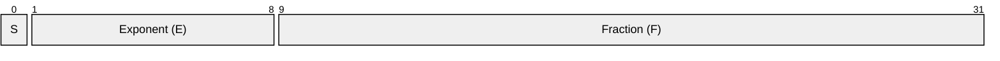

## 1. Binary Representation & The Normalization Rule

Floating-point numbers are essentially "scaled integers." In the IEEE-754 standard (such as the `binary32` format), they are represented by three distinct components.

### Bit Layout (IEEE-754 Single Precision)

| Part | Bits | Meaning |
| :--- | :--- | :--- |
| **Sign (S)** | bit 31 | `0` → positive, `1` → negative |
| **Exponent (E)** | bits 30-23 | Stored with a bias ($E = e + Bias$). For binary32, Bias is 127. |
| **Fraction (F)** | bits 22-0 | The fractional part of the significand. |

### The Normalized Form
To ensure uniqueness and maximize precision, we choose the pair $(M, e)$ such that $|M|$ is as large as possible.

*   **$\beta$**: Base / radix (here 2).
*   **$p$**: Precision (number of digits in the significand).
*   **$M$**: Integral significand ($0 \dots \beta^p - 1$).
*   **$e$**: Exponent, limited by $e_{min} \le e \le e_{max}$.
*   **Value Formula**: $x = M \cdot \beta^{e - p + 1}$

### Normal vs. Subnormal
The "Normal" domain starts when the magnitude $\|x\| \ge \beta^{e_{min}}$. 

| Type | Condition | Leading Digit |
| :--- | :--- | :--- |
| **Normal** | $\|x\| \ge \beta^{e_{min}}$ | Forced to be non-zero (implicit 1 in binary). |
| **Subnormal** | $0 < \|x\| < \beta^{e_{min}}$ | Leading digit is zero; used to prevent sudden underflow. |
| **Zero** | $x = 0$ | Handled as a special case bit pattern. |
 

---

## 2. Mathematical Framework & Toy Systems

To understand the density of floating-point numbers, we can analyze a "Toy System" where $\beta=2$, $p=3$, $e_{min}=-2$, $e_{max}=2$.

### Extremal Values
*   **Smallest positive subnormal $\alpha$:** $\beta^{e_{min} - p + 1}$
*   **Smallest positive normal:** $\beta^{e_{min}}$
*   **Largest finite FP $f_{max}$:** $\beta^{e_{max}+1} - \beta^{e_{max}-p+1}$

### The Number Line Distribution
The distance between consecutive FP numbers is multiplied by $\beta$ each time a power of $\beta$ is crossed.

### Counting Representable Numbers
| Type | Formula | Toy Example Count |
| :--- | :--- | :--- |
| **Normal** | $2 \cdot (\beta^p - \beta^{p-1}) \cdot (e_{max} - e_{min} + 1)$ | $2 \cdot (8-4) \cdot 5 = 40$ |
| **Subnormal** | $2 \cdot (\beta^{p-1} - 1)$ | $2 \cdot (4-1) = 6$ |

All finite FP numbers in a system are integer multiples of the tiny step $\alpha$.

---

## 3. Arithmetic Operations

I need to do that part actually.

---

## 4. Rounding, ULP, and Precision

Because we represent an infinite real line with finite bits, every operation involves a rounding function.

### Rounding Modes
| Mode | Meaning | Midpoint (Tie) Rule |
| :--- | :--- | :--- |
| **RNe** | Round to Nearest Even | Tie goes to the even significand (IEEE default). |
| **RNA** | Round to Nearest Away | Tie goes to the larger magnitude (Accounting). |
| **RN0** | Round to Nearest Zero | Tie goes to the smaller magnitude. |
| **RZ** | Round toward Zero | Simple truncation. |
| **RD / RU** | Round Down / Up | Toward $-\infty$ or $+\infty$ (Interval Arithmetic). |
| **SR** | Stochastic Rounding | Non-deterministic; $P(x) = \frac{RU(x)-x}{RU(x)-RD(x)}$. |

### Measuring Error: ULP and UFP
1.  **Unit Round-off ($u$):** $2^{-p}$. The smallest relative spacing, depending only on precision.
2.  **Unit in the Last Place (ULP):** $\text{ulp}(t) = 2^{\max \{ e_{\min}, \lfloor \log_{2} |t| \rfloor \} - p + 1}$. Measures spacing between floats around a specific value $t$.
3.  **Unit in the First Place (UFP):** $\text{ufp}(t) = 2^{\lfloor \log_{2} |t| \rfloor}$. The largest power of 2 not exceeding $|t|$.

### Faithful Rounding
A result is considered *faithful* if it is either the Floating Point number immediately below the real value ($RD(x)$) or the one immediately above ($RU(x)$). All standard rounding modes are faithful.

## 5. Exceptions, Edge Cases, and NaN

### Overflow and Underflow
*   **Overflow:** Occurs when the rounded result exceeds $f_{max}$. In RNe, this returns $\pm \infty$. Overflow threshold: $|result| \ge 2^{e_{\max}+1} - 2^{e_{\max}-p}$.
*   **Underflow:** Occurs when a result is smaller than $2^{e_{min}}$ and inexact.
*   **Spurious Exceptions:** Exceptions occurring in intermediate steps are avoided by scaling operands.

### Signed Zeros
IEEE-754 defines **$+0$** and **$-0$**. While they compare as equal, they are vital for maintaining signs in complex arithmetic and handling branch cuts.

### Not a Number (NaN)
NaN is used to prevent the system from halting during undefined operations.

| Type | Purpose |
| :--- | :--- |
| **Signaling NaN (sNaN)** | Represents uninitialized variables; triggers an exception if accessed. |
| **Quiet NaN (qNaN)** | Default result for invalid math; propagates through calculations. (scary!) |

**When is qNaN produced?**
*   $0 / 0$ or $\infty / \infty$
*   $0 \times \infty$
*   $\sqrt{Negative}$
*   $\infty - \infty$ (same signs)
*   $Remainder(x, 0)$

